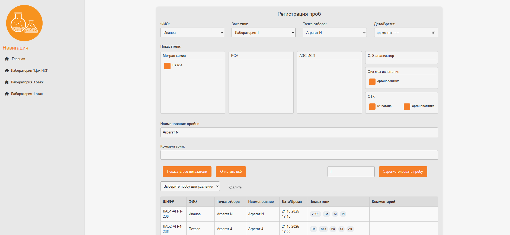
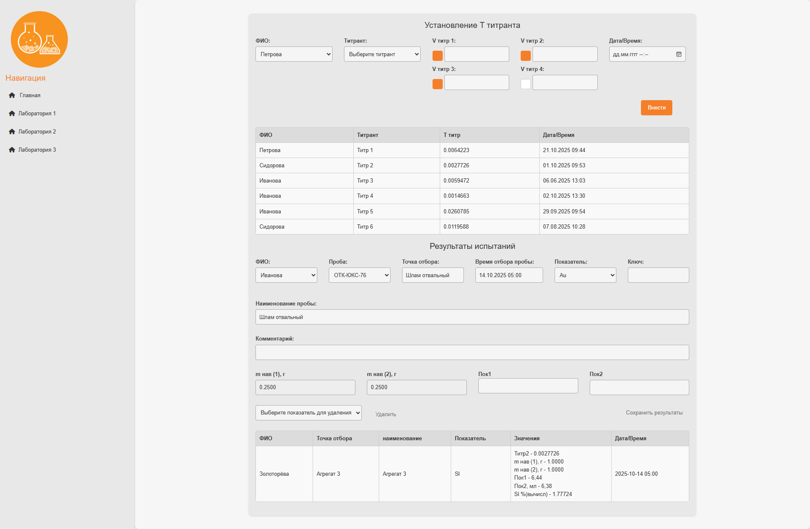
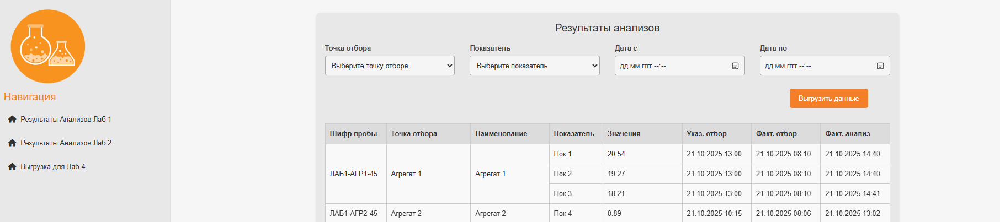
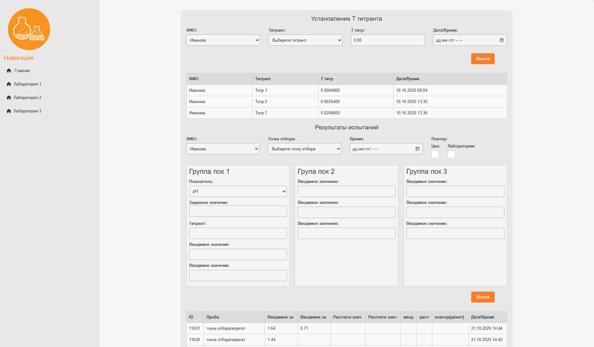
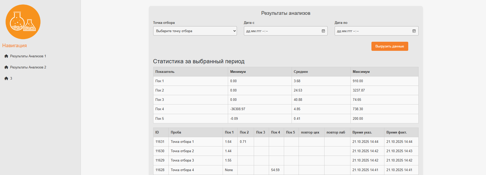

# Laboratory Tracking System

**Лабораторная система трекинга проб с полной фиксацией каждого шага анализа.**

## Содержание

1. [О проекте](#о-проекте)
2. [Быстрый старт](#быстрый-старт)
3. [Развёртывание проекта при помощи Docker (+ тесты)](#развёртывание-проекта-при-помощи-docker)
4. [Развёртывание проекта локально через Python (+ тесты)](#развёртывание-проекта-локально-через-python)
5. [Используемые технологии](#используемые-технологии)
6. [Структура проекта](#структура-проекта)
7. [Скриншоты](#скриншоты-интерфейса)
8. [Автор](#автор)

---

## О проекте

Система обеспечивает полный трекинг проб — от этапа отбора до окончательных результатов анализов.
Каждый этап фиксируется в базе данных, что позволяет получать детальную информацию о ходе анализа и
вести аналитику работы лаборатории.

Проект разработан на Django с использованием PostgreSQL и Docker.

---

## Быстрый старт (Windows CMD)

```cmd
git clone https://github.com/NickeyLA/LIMS.git
cd LIMS
copy .env.example .env
docker-compose up -d --build
docker-compose exec web python manage.py migrate
docker-compose exec web python manage.py collectstatic --noinput
docker-compose restart web
```

После сборки приложение будет досту пно по адресу:
[http://localhost:8000](http://localhost:8000)

---

## Развёртывание проекта при помощи Docker

1. Клонируйте репозиторий:

```bash
git clone https://github.com/NickeyLA/LIMS.git
cd LIMS
```

2. Создайте файл окружения:

```bash
cp .env.example .env
```

При необходимости отредактируйте `.env`.

3. Запуск тестов:

```bash
docker-compose run --rm tests
```

4. Сборка и запуск проекта:

```bash
docker-compose up --build
```

После запуска приложение будет доступно по адресу: [http://localhost:8000](http://localhost:8000)

5. Остановка контейнеров:

```bash
docker-compose down
```

---

## Развёртывание проекта локально через Python

Если вы хотите запустить проект без Docker:

1. Клонируйте репозиторий и создайте виртуальное окружение:

```bash
git clone https://github.com/NickeyLA/LIMS.git
cd LIMS
python -m venv venv
venv\Scripts\activate
```

2. Установите зависимости:

```bash
pip install -r requirements.txt
```

3. Создайте файл окружения:

```bash
copy .env.example .env
```

И отредактируйте `.env` при необходимости.

4. Примените миграции:

```bash
python manage.py migrate
```

5. Запуск тестов:

```bash
pytest
```

6. Запуск проекта:

```bash
python manage.py runserver 0.0.0.0:8000
```

Приложение будет доступно по адресу: [http://localhost:8000](http://localhost:8000)

---

## Используемые технологии

| Компонент       | Технология             |
| --------------- | ---------------------- |
| Backend         | Django 5, Python 3.12  |
| База данных     | PostgreSQL 16          |
| Контейнеризация | Docker, Docker Compose |
| Тестирование    | Pytest                 |
| Сервер          | Gunicorn               |
| Статика         | WhiteNoise             |

---

## Структура проекта

```
LIMS/
├── djangoweb/
│   └── settings.py
├── main/
├── laboratory_xa/
├── laboratory_otk/
├── laboratory_gmc/
├── techlab/
├── viewer/
├── viewer_gmc/
├── static/
├── docs/
├── Dockerfile
├── docker-compose.yml
├── requirements.txt
├── .env.example
└── README.md
```

---

## Скриншоты

### **Регистрация проб:**



---

### **Ввод анализов Лаб 1:**



### **Вывод анализов Лаб 1:**



---

### **Ввод анализов Лаб 2:**



### **Вывод анализов Лаб 2:**



---

### **Кастомная выгрузка:**


---

## Автор

**Николай Латухин**
Python / Django Developer

📧 [latuhinn83@gmail.com](mailto:latuhinn83@gmail.com)

📞 +7 (953) 183-55-42

💻 [GitHub](https://github.com/NickeyLA)

---
